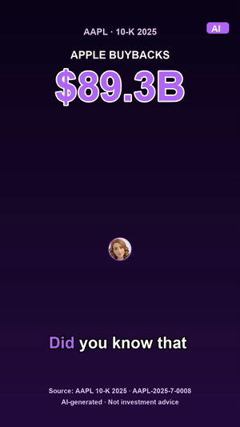
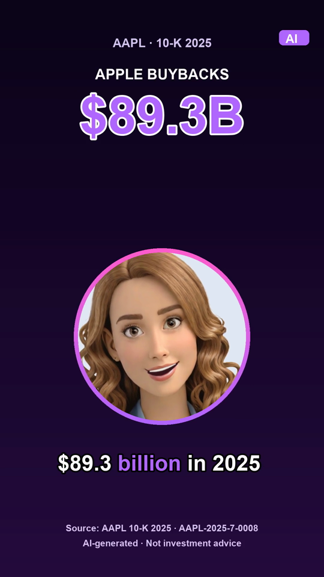
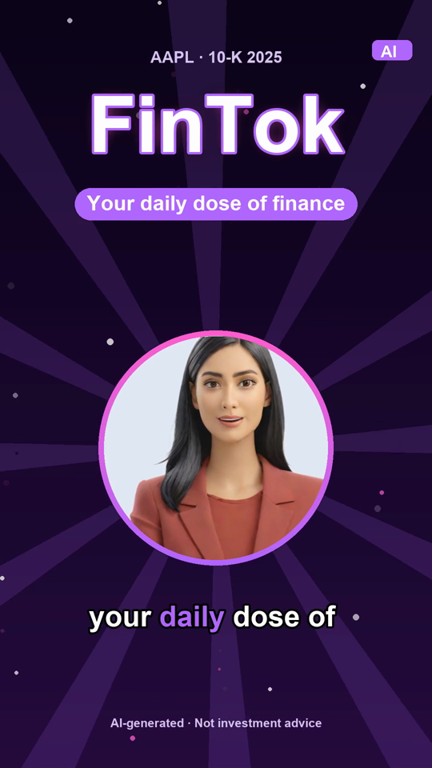
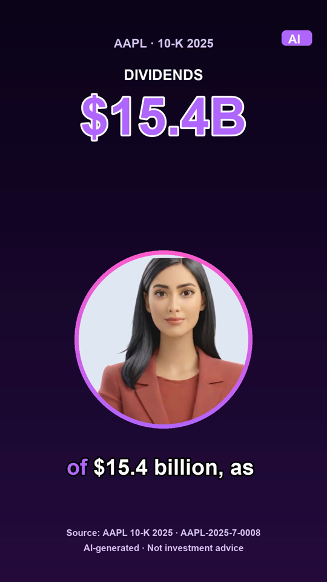
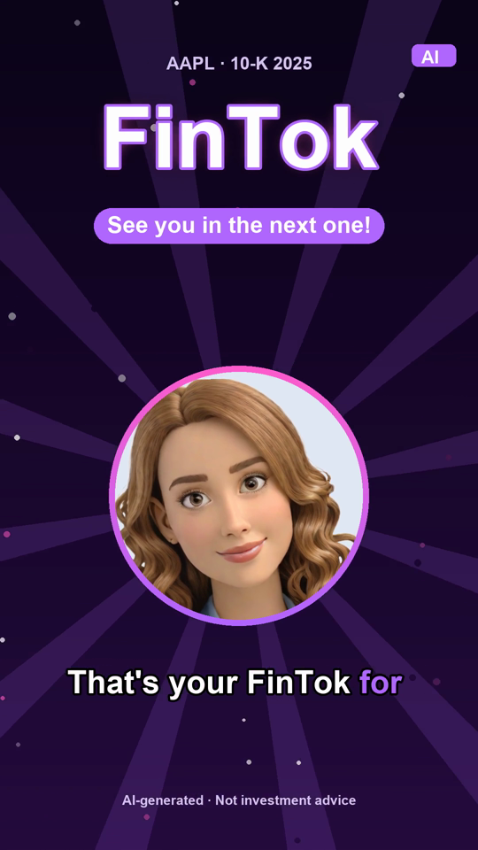
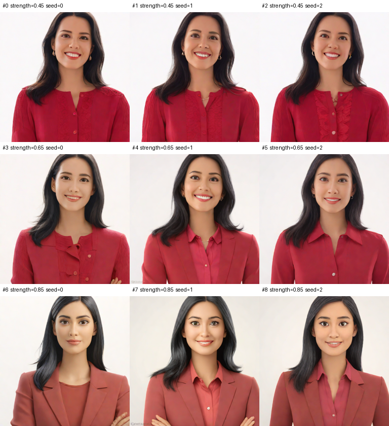
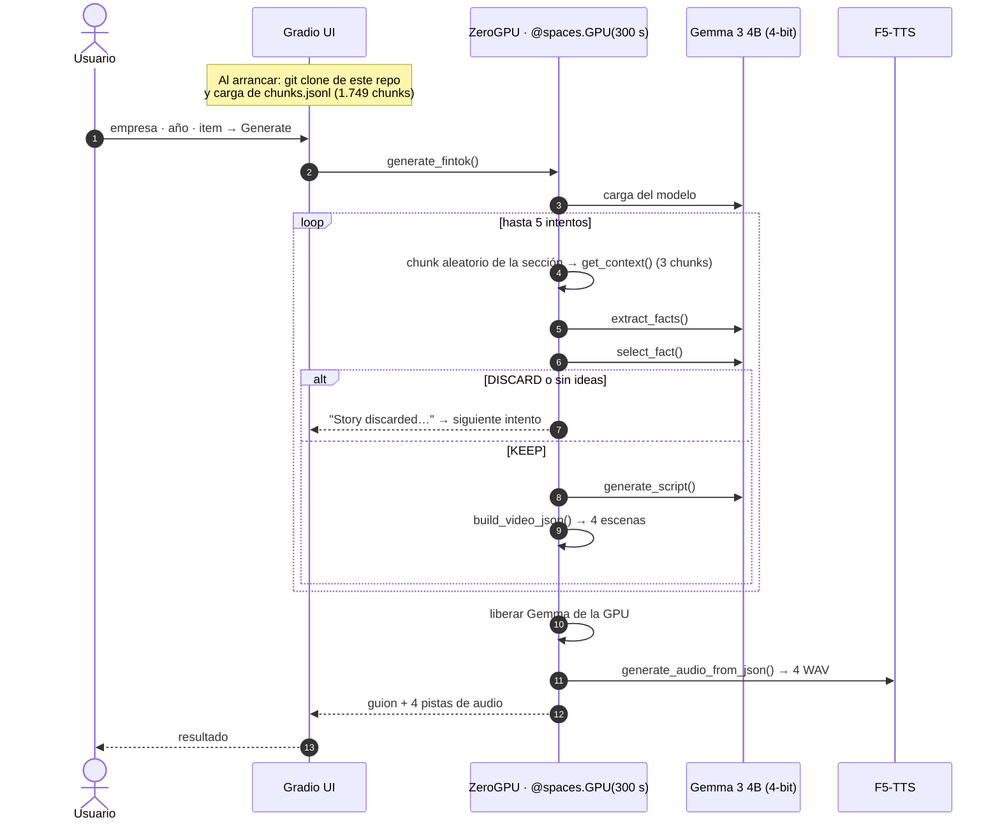
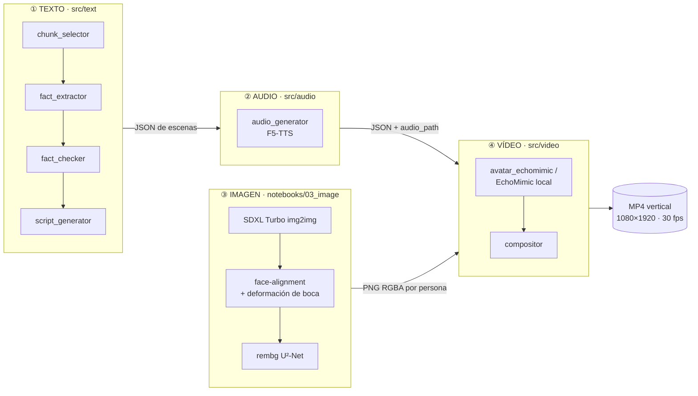
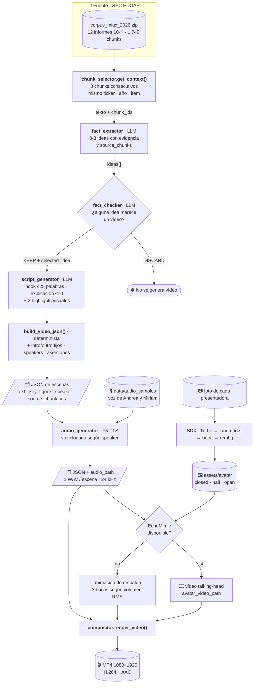
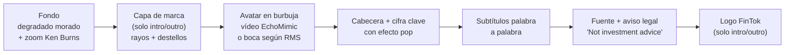

<div align="center">

# FinTok

**De un informe 10-K de 200 páginas a un vídeo vertical de 35 segundos, con cada cifra trazable hasta su fuente.**

FinTok es una plataforma multimodal que transforma información financiera oficial (informes anuales 10-K de la SEC) en vídeos cortos, verificables y listos para redes sociales: guion generado y comprobado con un LLM, voces clonadas, avatares animados y montaje automático.



[▶ Ver el vídeo completo con audio (MP4)](docs/demo_AAPL_2025.mp4) · [🤗 Probar la demo en Hugging Face](https://huggingface.co/spaces/mirdbg/FinTok)

`Python` · `Gemma 3 4B` · `F5-TTS` · `SDXL Turbo` · `EchoMimic` · `FFmpeg` · `Gradio` · `HF ZeroGPU` · `Google Colab (T4)`

</div>

---

## Índice

1. [El problema y la propuesta](#1-el-problema-y-la-propuesta)
2. [Capturas](#2-capturas)
3. [Demo interactiva en Hugging Face](#3-demo-interactiva-en-hugging-face)
4. [Arquitectura](#4-arquitectura)
5. [Flujo de datos multimodal](#5-flujo-de-datos-multimodal)
6. [Contrato de datos: el JSON de escenas](#6-contrato-de-datos-el-json-de-escenas)
7. [Módulos en detalle](#7-módulos-en-detalle)
8. [Selección de modelos](#8-selección-de-modelos)
9. [Corpus](#9-corpus)
10. [Verificabilidad e IA responsable](#10-verificabilidad-e-ia-responsable)
11. [Estructura del repositorio](#11-estructura-del-repositorio)
12. [Cómo ejecutarlo](#12-cómo-ejecutarlo)
13. [Limitaciones y próximos pasos](#13-limitaciones-y-próximos-pasos)

---

## 1. El problema y la propuesta

| | |
|---|---|
| **Problema** | Los 10-K contienen la información financiera más fiable de una empresa cotizada, pero son documentos de cientos de páginas escritos en lenguaje regulatorio. El público joven se informa en formatos cortos (TikTok, Reels, Shorts) donde abunda el contenido financiero sin fuentes. |
| **Propuesta** | Un pipeline que lee el 10-K, decide qué hecho merece contarse, lo redacta como guion hablado y lo convierte en un vídeo vertical con dos presentadoras virtuales. Cada escena lleva los `chunk_id` del 10-K de los que procede. |
| **Diferencial** | **Verificabilidad**: el modelo solo puede usar el texto del 10-K, puede descartar contenido poco relevante (`DISCARD`) y la fuente aparece en pantalla. Todo funciona con **modelos abiertos** en una GPU gratuita de Colab. |

---

## 2. Capturas

Fotogramas reales generados por [`src/video/compositor.py`](src/video/compositor.py) a partir de [`outputs/text/example_02.json`](outputs/text/example_02.json) (10-K 2025 de Apple) y los audios de [`outputs/audio/example_02/`](outputs/audio/example_02/).

<p align="center">
  
  
  
  
</p>

| Escena | Quién habla | Qué se ve |
|---|---|---|
| **1 · Hook** | Andrea | Pregunta que engancha + cifra clave grande (`$89.3B`) + fuente `AAPL-2025-7-0008` |
| **2 · Intro** | Miriam | Logo FinTok con efecto *pop*, rayos giratorios, destellos y eslogan |
| **3 · Explicación** | Miriam | Desarrollo del hecho con un segundo dato destacado (`$15.4B`) y subtítulos palabra a palabra |
| **4 · Outro** | Andrea | Cierre de marca con destello de salida |

### Generación de los avatares

| Variantes SDXL Turbo (`strength` × `seed`) | Detección de la boca (68 landmarks) | Estados de boca: cerrada · media · abierta |
|---|---|---|
|  |  |  |

---

## 3. Demo interactiva en Hugging Face

> 🤗 **Pruébalo aquí:** [huggingface.co/spaces/mirdbg/FinTok](https://huggingface.co/spaces/mirdbg/FinTok)

Una aplicación **Gradio** desplegada en un Space de Hugging Face con **ZeroGPU** (NVIDIA A10G), que ejecuta el pipeline real del repositorio de principio a fin, **desde el 10-K hasta las voces**:

1. El usuario elige **empresa**, **año fiscal** y **sección del 10-K** (1A, 7, 7A u 8).
2. Pulsa **Generate FinTok**.
3. La app busca sola una historia dentro de esa sección, escribe el guion y genera las cuatro pistas de voz, mostrando en cada momento en qué paso está.
4. Resultado: el guion de las 4 escenas, con la cifra que aparecería en pantalla, los `chunk_id` de origen y **4 reproductores de audio** (Andrea y Miriam).

### La demo paso a paso

**1 · Selecciona qué quieres explorar**

Elige la empresa, el ejercicio fiscal y la sección del 10-K. FinTok se encarga de explorar el contenido y encontrar una historia relevante.

<p align="center">
  
  &nbsp;&nbsp;
  
</p>

<br>

**2 · FinTok encuentra y construye la historia**

La aplicación devuelve un guion de cuatro escenas —hook, intro, explicación y outro— manteniendo la trazabilidad hasta los chunks originales del 10-K.

<p align="center">
  
  &nbsp;&nbsp;
  
</p>

<br>

**3 · Escucha y descarga el resultado**

Las cuatro escenas se generan con las voces de Andrea y Miriam mediante F5-TTS. El resultado completo puede descargarse como JSON junto con las pistas de audio.

<p align="center">
  
  &nbsp;&nbsp;
  
</p>



**Decisiones de diseño**

| Decisión | Motivo |
|---|---|
| El Space **clona este repositorio de GitHub al arrancar** e importa `src/text` y `src/audio`. | El código de los notebooks, el de la demo y el del repositorio es el mismo. Cualquier mejora en GitHub llega al Space con un simple reinicio. |
| **Exploración aleatoria con hasta 5 intentos.** | El usuario no tiene que conocer los `chunk_id`. El `DISCARD` del editor funciona como filtro de calidad real: si un fragmento no da para un vídeo, se prueba otro. |
| **Una sola sesión de GPU** de 300 s para texto y voz. | ZeroGPU asigna la GPU por llamada. Encadenar las dos fases evita volver a la cola entre una y otra. |
| **Gemma se libera antes de cargar F5-TTS.** | Los dos modelos no caben a la vez en la memoria de vídeo (VRAM) asignada. |
| Estado en directo con `yield` y `gr.Progress`. | La generación tarda minutos, así que el usuario ve en qué paso está: extracción, revisión editorial, guion o voces. |
| **El vídeo no se genera en el Space.** | El lip-sync de EchoMimic necesita ≈ 200 s de GPU por escena y no cabe en la cuota de ZeroGPU. El vídeo se monta en Colab con [`04_video/01_echomimic_local.ipynb`](notebooks/04_video/01_echomimic_local.ipynb). |

---

## 4. Arquitectura

FinTok está dividido en cuatro capas, una por modalidad. Cada capa lee y escribe el **mismo JSON de escenas**, que actúa como contrato entre ellas. Así cada capa se puede desarrollar, probar y sustituir por separado.



| Capa | Entrada | Modelo / herramienta | Salida | Código |
|---|---|---|---|---|
| **Texto** | `chunks.jsonl` del corpus 10-K | Gemma 3 4B IT (4-bit NF4) | JSON de 4 escenas | [`src/text/`](src/text/) |
| **Audio** | JSON de escenas + muestras de voz | F5-TTS (clonación *zero-shot*) | 1 WAV por escena + `audio_path` | [`src/audio/`](src/audio/) |
| **Imagen** | Una foto frontal por presentadora | SDXL Turbo · face-alignment · rembg | `<persona>_{closed,half,open}.png` | [`notebooks/03_image/`](notebooks/03_image/) |
| **Vídeo** | JSON con audio + avatares | EchoMimic (opcional) · Pillow · FFmpeg | MP4 1080×1920 | [`src/video/`](src/video/) |

**Principios de diseño**

- **Un único modelo cargado, inyectado como función.** Los módulos de texto no cargan modelos: reciben `generate_fn(system, user, max_new_tokens) -> (texto, latencia)`. El mismo código funciona con Gemma, Qwen, Mistral o una API.
- **Lo que no necesita IA, no usa IA.** La intro, el outro, la asignación de presentadoras y la estructura final del JSON se construyen de forma determinista en Python, con aserciones.
- **El JSON es la fuente de verdad.** El audio no asigna voces por número de escena; lee `speaker`. El montador no publica escenas con `verified: false`.
- **Degradación elegante.** Si EchoMimic no está disponible, el montador anima el avatar con 3 imágenes de boca sincronizadas con el volumen de la voz. Si no hay audio, estima la duración por número de palabras.

---

## 5. Flujo de datos multimodal

Recorrido completo de un dato, desde el fragmento del 10-K hasta el fotograma:



### Qué viaja entre etapas

| Etapa | Modalidad | Artefacto | Campos que añade |
|---|---|---|---|
| Selección de contexto | texto | `DataFrame` de 3 chunks | `chunk_id`, `ticker`, `fiscal_year`, `item`, `texto` |
| Extracción | texto → JSON | `{"ideas": [...]}` | `idea`, `evidence`, `source_chunks` |
| Selección editorial | JSON | `{"decision": ...}` | `decision` (KEEP/DISCARD), `selected_idea`, `reason` |
| Redacción | JSON | `{"hook": ...}` | `hook`, `hook_highlight`, `explanation`, `explanation_highlight` |
| Construcción | JSON | JSON de escenas | `scenes[]` con `speaker`, `key_figure`, `source_chunk_ids`, `verified` |
| Síntesis de voz | texto → audio | WAV mono 24 kHz | `audio_path` |
| Talking head | imagen + audio → vídeo | MP4 512×512 | `avatar_video_path` (opcional) |
| Montaje | todo → vídeo | MP4 1080×1920 | — |

### Cómo se compone cada fotograma

El montador ([`compositor.py`](src/video/compositor.py)) dibuja cada fotograma por capas y lo envía a FFmpeg por una tubería (sin escribir imágenes intermedias a disco):



La duración de cada escena la marca su audio real, más 0,25 s de pausa. El volumen (envolvente RMS por fotograma, con ataque rápido y caída suave) decide qué imagen de boca mostrar: `< 0.12` cerrada, `< 0.40` media, el resto abierta.

---

## 6. Contrato de datos: el JSON de escenas

Todas las capas comparten este formato. Ejemplo real: [`outputs/text/example_01.json`](outputs/text/example_01.json).

```json
{
  "company": "AAPL",
  "year": 2025,
  "language": "en",
  "scenes": [
    {
      "scene_id": 1,
      "scene_type": "hook",
      "speaker": "ANDREA",
      "text": "Did you know that Apple spent a massive $89.3 billion in 2025 just buying back its own stock and paying dividends?",
      "key_figure": "Apple buybacks: $89.3B",
      "source_chunk_ids": ["AAPL-2025-7-0008"],
      "verified": true,
      "audio_path": "outputs/audio/example_02/audio_01.wav"
    }
  ]
}
```

| Campo | Lo escribe | Lo lee | Descripción |
|---|---|---|---|
| `scene_type` | texto | vídeo | `hook` · `intro` · `explanation` · `outro`. `intro`/`outro` activan los efectos de marca. |
| `speaker` | texto | audio, vídeo | `ANDREA` o `MIRIAM`. Elige voz y avatar. |
| `text` | texto (LLM) | audio, vídeo | Lo que se dice. También genera los subtítulos. |
| `key_figure` | texto (LLM) | vídeo | Dato grande en pantalla. El formato `Etiqueta: valor` se separa en dos líneas. |
| `source_chunk_ids` | texto | vídeo | Trazabilidad: se imprime como `Source: AAPL 10-K 2025 · <ids>`. |
| `verified` | texto | vídeo | El montador descarta las escenas con `false`. |
| `audio_path` | audio | vídeo | WAV generado por F5-TTS. |
| `avatar_video_path` | vídeo | vídeo | MP4 de EchoMimic (opcional). |
| `word_timestamps` | — | vídeo | Opcional. Si no existe, los tiempos de cada palabra se reparten según su longitud. |

---

## 7. Módulos en detalle

### ① Texto — [`src/text/`](src/text/)

Pipeline **Extract → Select → Write → Build**, con tres llamadas al LLM y un paso determinista.

| Módulo | Función | Tipo | Detalle |
|---|---|---|---|
| [`chunk_selector.py`](src/text/chunk_selector.py) | `get_context()` | determinista | Ventana de 3 chunks consecutivos de la misma sección. En los bordes se desplaza para mantener 3. `build_context_groups()` trocea todo el corpus en grupos sin solape para una ejecución masiva. |
| [`fact_extractor.py`](src/text/fact_extractor.py) | `extract_facts()` | LLM · 700 tokens | Hasta 3 ideas (≤ 40 palabras) con evidencia (≤ 30 palabras) y `source_chunks`. Prohíbe el conocimiento externo y especular, e incluye reglas específicas para leer bien las tablas. |
| [`fact_checker.py`](src/text/fact_checker.py) | `select_fact()` | LLM · 300 tokens | El "editor": elige **como máximo una** idea, la contrasta con el texto original y puede devolver `DISCARD`. Rechaza boilerplate legal, lenguaje contable rutinario y trivialidades. |
| [`script_generator.py`](src/text/script_generator.py) | `generate_script()` | LLM · 350 tokens | Hook (≤ 25 palabras) + explicación (2-3 frases, ≤ 70 palabras) + dos *highlights* de 3-7 palabras que no pueden introducir datos nuevos. |
| | `build_video_json()` | determinista | Añade intro y outro fijos, asigna presentadoras (Andrea: hook y outro; Miriam: intro y explicación) y valida la estructura con aserciones. |

Los tres parsers de JSON toleran los errores habituales de los LLM pequeños: bloques ` ```json `, texto antes o después del objeto y caracteres de control dentro de las cadenas.

**Por qué tres llamadas y no una:** el notebook [`02_gemma_text_pipeline_manual`](notebooks/01_text/02_gemma_text_pipeline_manual.ipynb) compara este pipeline con un *direct summary* (chunk → guion). Separar extracción, juicio editorial y redacción impide que el modelo "decore" los hechos al redactar, y permite descartar fragmentos sin interés en lugar de forzar un vídeo.

### ② Audio — [`src/audio/audio_generator.py`](src/audio/audio_generator.py)

- **F5-TTS** con clonación *zero-shot*: cada presentadora tiene un WAV de referencia en [`data/audio_samples/`](data/audio_samples/), normalizado con FFmpeg a mono 24 kHz.
- Si `ref_text` está vacío, F5-TTS transcribe la referencia internamente (Whisper).
- **Volumen homogéneo entre voces:** cada WAV generado se normaliza con el filtro `loudnorm` de FFmpeg (EBU R128: −16 LUFS, pico real −1,5 dB). Dos voces clonadas pueden tener picos parecidos y sonar con volúmenes distintos; normalizar la sonoridad percibida lo evita.
- Solo se preparan las voces que aparecen en el JSON. El valor original de `speaker` se conserva.
- Uso desde CLI: `python -m src.audio.audio_generator <json> [--output-dir] [--output-json] [--speed]`.

### ③ Imagen — [`notebooks/03_image/01_avatar_cartoon.ipynb`](notebooks/03_image/01_avatar_cartoon.ipynb)

1. **SDXL Turbo img2img** convierte la foto en un personaje estilo Pixar (4 pasos, `guidance_scale=0`). Se prueba una rejilla `strength ∈ {0.45, 0.65, 0.85}` × 3 semillas y se elige a mano.
2. **Boca abierta sin difusión**: los modelos de difusión no cambiaban la expresión de forma fiable, así que se detecta la boca con **face-alignment** (landmarks 48-67) y se abre con una **deformación geométrica** (baja el labio inferior y la barbilla y rellena el interior). El resto de la cara queda idéntico píxel a píxel.
3. **rembg (U²-Net)** calcula la silueta una sola vez y la aplica a los tres estados, para que el contorno no tiemble.
4. Se guardan los parámetros en `<persona>_meta.json` para poder reproducirlos.

### ④ Vídeo — [`src/video/`](src/video/)

| Componente | Qué hace |
|---|---|
| [`avatar_echomimic.py`](src/video/avatar_echomimic.py) | Envía avatar + audio al Space `fffiloni/EchoMimic` de Hugging Face, guarda el resultado en caché (SHA-1 de imagen + audio + parámetros) y, si el Space falla, deja la escena con el avatar de respaldo. |
| [`notebooks/04_video/01_echomimic_local.ipynb`](notebooks/04_video/01_echomimic_local.ipynb) | Ejecuta EchoMimic (versión acelerada) **en la propia T4 de Colab**. EchoMimic necesita Python 3.10 y Colab trae 3.13, así que se crea un entorno aislado con `uv`. Solo se descargan ~12 GB de pesos de los más de 60 GB del repositorio. |
| [`compositor.py`](src/video/compositor.py) | Montador final (ver [diagrama de capas](#cómo-se-compone-cada-fotograma)). Lee los vídeos de EchoMimic fotograma a fotograma desde FFmpeg, sin cargarlos en memoria. Toda la estética (colores, tamaños, umbrales, textos en `es`/`en`) se configura con la *dataclass* `Style`. |

> **Por qué EchoMimic en local:** la cuota gratuita de ZeroGPU del Space público (≈ 200 s de GPU por escena) solo daba para una escena al día.

---

## 8. Selección de modelos

Cada elección de modelo se ha tomado comparando alternativas en un notebook.

### LLM de texto — [`01_text_model_comparison.ipynb`](notebooks/01_text/01_text_model_comparison.ipynb)

Muestra estratificada de 8 chunks (empresa × año × item × con/sin tabla), mismo prompt, cuantización 4-bit NF4, Tesla T4:

| Modelo | JSON válido | Latencia media | Ideas / chunk |
|---|:---:|:---:|:---:|
| **Gemma 3 4B IT** ✅ | **100 %** | **32,7 s** | 3,0 |
| Mistral 7B Instruct v0.3 | 87,5 % | 41,6 s | 3,0 |
| Qwen3 4B Instruct 2507 | 75,0 % | 37,5 s | 3,0 |

Se eligió **Gemma 3 4B IT** por su JSON siempre válido, su fidelidad al texto en la revisión manual y su latencia. Es una decisión pragmática con una muestra pequeña, no un benchmark exhaustivo.

Latencia medida del pipeline completo (T4, ejemplo `AAPL-2024-8-0043`): extract ≈ 47 s · select ≈ 18 s · write ≈ 19 s.

### Clonación de voz — [`01_voice_cloning.ipynb`](notebooks/02_audio/01_voice_cloning.ipynb)

| Modelo | Enfoque | Resultado |
|---|---|---|
| **F5-TTS** ✅ | *Zero-shot* con audio + transcripción de referencia | Elegido: el que mejor conserva timbre y prosodia de las referencias |
| XTTS-v2 (Coqui) | Clonación multilingüe sin transcripción | Problemas de instalación en el Python 3.13 de Colab y licencia restrictiva |
| OpenVoice V2 + MeloTTS | TTS base + transferencia de timbre | Tiende a sonar a la voz base |

### Avatar animado

| Opción | Calidad | Coste | Uso en FinTok |
|---|---|---|---|
| **EchoMimic local (Colab T4)** | Alta: lip-sync real guiado por audio | ~12 GB de pesos, GPU | Principal |
| EchoMimic vía HF Space | Alta | Cuota ZeroGPU ≈ 1 escena/día | Descartado como principal |
| **3 bocas + RMS** | Media: estilo "cartoon" | CPU, instantáneo | Respaldo automático |

---

## 9. Corpus

[`data/corpus_miax_2026.zip`](data/corpus_miax_2026.zip): informes 10-K públicos descargados de SEC EDGAR.

| | |
|---|---|
| **Empresas** | NVDA · MSFT · AAPL · GOOGL · META · AMZN |
| **Ejercicios** | FY2024 y FY2025 (12 informes) |
| **Items** | 1A *Risk Factors* · 7 *MD&A* · 7A *Market Risk* · 8 *Financial Statements* |
| **Chunks** | 1.749 fragmentos de ~500 tokens con 80 de solape (721 contienen tablas) |
| **Ficheros** | `chunks.jsonl` · `secciones.jsonl` · `xbrl_facts.parquet` · `MANIFEST.md` (hashes SHA-256) |

El formato del `chunk_id` (`AAPL-2025-7-0008` = ticker · año fiscal · item · posición) permite localizar cualquier cita en el documento original.

---

## 10. Verificabilidad e IA responsable

| Riesgo | Mitigación en FinTok |
|---|---|
| Alucinaciones | Los prompts prohíben el conocimiento externo. Cada idea lleva `evidence` literal y `source_chunks`. El editor contrasta la idea con el texto original. |
| Contenido irrelevante o *clickbait* | El editor puede decir `DISCARD`. El prompt de redacción prohíbe exagerar y el *clickbait* engañoso. |
| Datos nuevos en pantalla | Los *highlights* deben salir de la propia explicación ("never introduce a new fact"). |
| Asesoramiento financiero | Prompt: "avoid investment advice". En cada fotograma: *AI-generated · Not investment advice* y la etiqueta **AI**. |
| Trazabilidad | `source_chunk_ids` se imprime en pantalla como `Source: AAPL 10-K 2025 · AAPL-2025-7-0008`. |
| Voz y rostro | Solo se clonan las voces y rostros de las autoras, con su consentimiento. |

---

## 11. Estructura del repositorio

```
FinTok/
├── src/
│   ├── text/                    ① guion verificable
│   │   ├── chunk_selector.py        ventana de 3 chunks
│   │   ├── fact_extractor.py        EXTRACT  (LLM)
│   │   ├── fact_checker.py          SELECT   (LLM)
│   │   └── script_generator.py      WRITE    (LLM) + build_video_json()
│   ├── audio/
│   │   └── audio_generator.py   ② F5-TTS, 1 WAV por escena
│   └── video/
│       ├── avatar_echomimic.py  ④ talking head vía HF Space + caché
│       └── compositor.py        ④ montador 1080×1920
├── notebooks/
│   ├── 01_text/   01 comparación de LLM · 02 iteración manual · 03 pipeline modular
│   ├── 02_audio/  01 comparación de clonación de voz · 02 pipeline de audio final
│   ├── 03_image/  01 avatares cartoon
│   └── 04_video/  01 EchoMimic local + montaje
├── data/
│   ├── corpus_miax_2026.zip     corpus 10-K
│   ├── audio_samples/           voces de referencia
│   └── samples/aapl_2024.json   JSON de ejemplo sin speakers
├── assets/avatar/              {andrea,miriam}_{closed,half,open}.png + preview.gif + meta.json
├── outputs/
│   ├── text/example_0{1,2}.json     JSON de escenas generados
│   └── audio/example_0{1,2}/        WAV por escena
└── docs/                        capturas y vídeo demo de este README
```

---

## 12. Cómo ejecutarlo

### Sin instalar nada: el Space

La [demo de Hugging Face](https://huggingface.co/spaces/mirdbg/FinTok) genera el guion y las voces desde el navegador.

### En Google Colab (pipeline completo, incluido el vídeo)

Todos los notebooks clonan el repositorio y están preparados para una **GPU T4**. Gemma es un modelo *gated*: hay que aceptar su licencia en Hugging Face y guardar `HF_TOKEN` en *Secrets* de Colab.

| Paso | Notebook | |
|---|---|---|
| 1 · Texto | `notebooks/01_text/03_modular_text_pipeline_example.ipynb` | [](https://colab.research.google.com/github/mirdbg/FinTok/blob/main/notebooks/01_text/03_modular_text_pipeline_example.ipynb) |
| 2 · Audio | `notebooks/02_audio/02_Audio_Final.ipynb` | [](https://colab.research.google.com/github/mirdbg/FinTok/blob/main/notebooks/02_audio/02_Audio_Final.ipynb) |
| 3 · Avatares | `notebooks/03_image/01_avatar_cartoon.ipynb` | [](https://colab.research.google.com/github/mirdbg/FinTok/blob/main/notebooks/03_image/01_avatar_cartoon.ipynb) |
| 4 · Vídeo | `notebooks/04_video/01_echomimic_local.ipynb` | [](https://colab.research.google.com/github/mirdbg/FinTok/blob/main/notebooks/04_video/01_echomimic_local.ipynb) |

### Por código

```python
# ① Texto (generate_fn: cualquier función (system, user, max_new_tokens) -> (texto, latencia))
from src.text import get_context, extract_facts, select_fact, generate_script, build_video_json

ctx = get_context(df, "AAPL-2025-7-0008")
ext = extract_facts(ctx, generate_fn=ask_gemma)
sel = select_fact(ctx, ext, generate_fn=ask_gemma)
scr = generate_script(ctx, sel, generate_fn=ask_gemma)   # None si DISCARD
video_json = build_video_json(ctx, scr)
```

```bash
# ② Audio
python -m src.audio.audio_generator outputs/text/example_02.json --output-dir outputs/audio/AAPL_2025
```

```python
# ④ Vídeo (sin GPU: usa la animación de 3 bocas)
import sys; sys.path.insert(0, "src/video")
from compositor import render_video
render_video("outputs/audio/AAPL_2025/script_with_audio.json",
             avatar_dir="assets/avatar", out_path="outputs/video/AAPL_2025.mp4")
```

**Dependencias principales:** `transformers>=4.51`, `accelerate`, `bitsandbytes`, `pandas`, `f5-tts`, `soundfile`, `numpy`, `scipy`, `Pillow`, `gradio_client` (opcional) y `ffmpeg` en el sistema. El montador funciona en CPU: el vídeo de demo de 35 s se renderiza en unos 45 s en un portátil.

---

## 13. Limitaciones y próximos pasos

| Estado actual | Siguiente paso |
|---|---|
| El pipeline de texto se ha probado en ejemplos concretos, chunk a chunk. | Ejecución masiva con `build_context_groups()` sobre los 1.749 chunks y ranking de candidatos. |
| `verified: true` se fija al construir el JSON; la verificación la hace el mismo LLM que redacta. | Comprobación independiente: contrastar las cifras con `xbrl_facts.parquet` (la fuente autorizada de números del corpus) y/o un segundo modelo como juez. |
| Los subtítulos reparten el tiempo por longitud de palabra. | Usar `word_timestamps` reales (alineación forzada con Whisper). |
| Benchmark de LLM con 8 chunks y métricas de formato. | Evaluación humana de fidelidad e interés sobre una muestra mayor. |
| Solo en inglés. | El montador ya soporta textos de interfaz en `es`; faltan prompts y voces en español. |
| El Space genera guion y voces, pero no el vídeo. | Montar el vídeo en el Space con la animación de 3 bocas, que solo necesita CPU (≈ 45 s para un vídeo de 35 s), y dejar EchoMimic para la versión de alta calidad. |
| Sin `requirements.txt` ni orquestador de extremo a extremo. | Script `fintok run <chunk_id>` que encadene las cuatro capas. |


---

<div align="center">

**Equipo:** Andrea · Miriam — Proyecto MIAX 2026

<sub>FinTok genera contenido educativo con IA a partir de documentos públicos de la SEC. No constituye recomendación de inversión.</sub>

</div>
